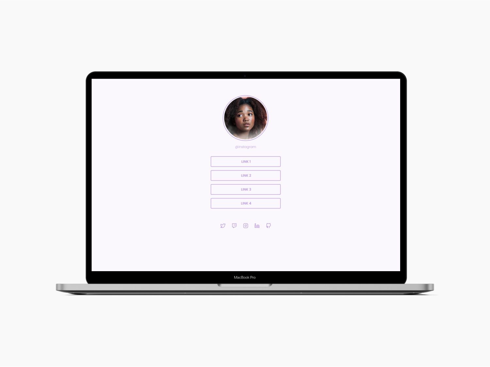

# Social Tree
Projeto proposto na plataforma da **Rocketseat**. Tem como finalidade colocar em prática as seguintes tecnologias:

* HTML
* CSS

## :dart: Objetivo do projeto
Criar uma página com uma lista de links que pode ser usada em perfis de redes sociais. Tendo como base o layout abaixo:

## :thumbsup: Resultado final
<h3>Quer ver :eyes: como ficou o resultado final? 
da uma olhada no link da página: :point_down:</h3>
<h3>:smirk::point_right: <a href="https://alvaronascimento-dev.github.io/social-tree-challenge-rocketseat/" target="_blank">Social Tree</a></h3>
